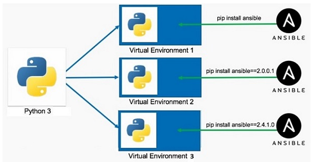

# python 3.x (since 2008)
## 1 Intro
- **high-level**
- open-source and cross-platform programming language
- **interpreted** 
  - processed at runtime by the interpreter.
  - do not need to compile your program
- **OOPS, functional, procedural**
- extensive lib:
  - GUI development
  - Db connectivity
  - ...
  - pyspark
---
## 2 usage
- Web development
- Data Science 
- machine learning
- Job scheduling, Automation and scripting
- ETl (pySpark)
- more
  - Desktop GUI Applications
  - Console-based Applications
  - Game Development

---
## 3 install and run
-  https://www.python.org/
- update env var:  PATH, PYTHONPATH, PYTHONHOME
```shell
sudo apt-get install python3.11
sudo yum install python3
```
- linux: Python's executable is installed in **/usr/bin/** directory
- windows:   **C:\python311**
- REPL : py enter, then >>> prompt will come. quit()
- run : **python3 prog-1.py**
- **Shebang** 
  - #! /usr/bin/python3.11
  - script itself can be a self executable in Linux, like a shell script
  - run directly: ./prog-1.py
- 

---
## 4 pip3
- pip3 install lib-1

---
## 5 Venv
- system-wide installation done above.
- need isolated environments of Python, for diff appl.
- **python3 -m venv myvenv**
- myvenv\scripts\**activate**
- 
